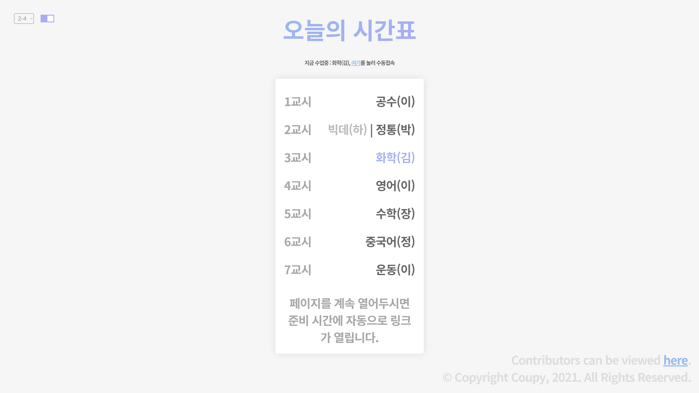

# online-schedule
> 언제 시간표 켜고, 오늘 날짜 찾고, 링크 일일히 누를래? 그냥 봐!

## What is this?

매일매일의 우리반 시간표를 가져와 보여주고, 준비 시간이 되면 자동으로 줌 링크를 열어주는 웹앱입니다.

## How to use?

그냥 [여기](https://schedule.coupy.dev/)로 접속하세요!   
좌측 상단의 드롭다운 메뉴로 우리 반을 정하면 끝입니다.

일단 한 번 정해두면 `localStorage`에 저장되므로 다시 지정해 줄 필요가 없습니다✨

이제 [`DIMIGOIN`](https://github.com/dimigoin)의 시간표를 `Online-schedule`에서 사용할 수 있어요! 
좌측 상단 토글 스위치로 기존 방법과 새로운 방법을 자유롭게 선택할 수 있습니다✨

## Build manual

빌드 할 필요가 없습니다!   
그냥 [접속](https://schedule.coupy.dev/)하거나, [Releases](https://github.com/HyeokjinKang/online-schedule/releases)에서 최신 릴리즈를 다운받고, index.html을 여세요!